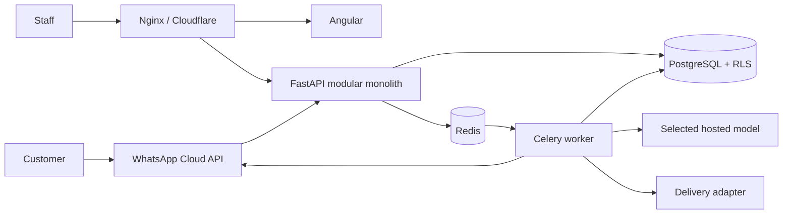

# Architecture and security boundaries

## Runtime boundaries

- Angular is an untrusted client. Authorization is recomputed server-side.
- FastAPI is one modular deployment for identity, catalogue, messaging, orders, delivery, AI and operations.
- PostgreSQL is the authority for messages, commerce state, idempotency and outbox work. Redis loss cannot erase an accepted message.
- Workers execute provider calls from durable work records and must tolerate redelivery.
- AI receives bounded context and allowlisted tools. Company and actor identity are injected by the server.

## Tenant isolation

Every company request resolves the signed user before membership lookup. On PostgreSQL, the API sets `app.current_company_id` transaction-locally and forced RLS policies filter tenant tables. The runtime database role must not own tables and must not have `BYPASSRLS`. Application queries also include `company_id` so test environments and reviews expose intent.

## Transaction boundaries

Order confirmation locks the order and variants, verifies the latest quote/expiry/current prices/current available stock, reserves stock, appends evidence and audit data, then commits once. Provider calls never occur inside this database transaction.

Webhook receipt verifies the raw-body signature before persistence. A provider/external-ID uniqueness constraint makes retries safe. A later dispatcher will claim work from PostgreSQL and publish/process it without relying on transient Redis state.

## Threat model

| Threat | Control |
|---|---|
| Tenant identifier substitution | Membership check, explicit company predicates, RLS, cross-tenant tests |
| Prompt/catalogue injection | Untrusted-content separation, allowlisted tool schemas, backend-rendered transactional facts |
| Webhook forgery/replay | HMAC verification over raw bytes and provider-scoped uniqueness |
| Overselling/races | Row locks, current-price recheck and atomic reservations |
| Duplicate shipment/order | Idempotency key storage and provider reference reconciliation |
| Stolen password/token | Argon2id, short token lifetime; refresh rotation/MFA remain pre-pilot work |
| Secret exposure | Environment secrets, encrypted provider credentials before production, redacted logs |

