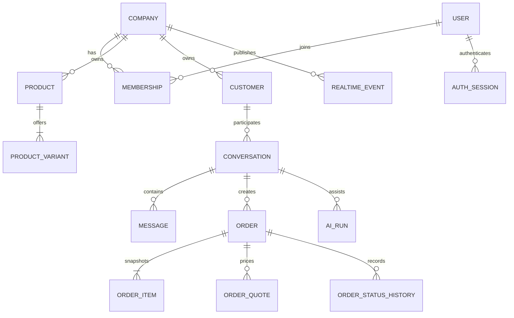

# Data model

All business identifiers are UUIDs. Money uses integer minor units; TND has three decimal places, so `39900` represents 39.900 TND. Timestamps are stored in UTC.

Products own one or more variants. Company-scoped SKU uniqueness, non-negative input validation, `stock_on_hand`, `stock_reserved` and an optimistic `version` support inventory decisions. Orders copy display name, SKU and price so later catalogue edits do not rewrite history.

Quotes are append-only versions and expire after 15 minutes. Confirmation references the latest version and stores explicit evidence. Status history is append-only. Webhook and outbox records support durable asynchronous work; audit logs contain safe metadata rather than provider secrets or chain-of-thought.

The additive session/AI migration stores only hashes for refresh credentials, records AI model/usage/latency without private reasoning, adds durable outbound attempt metadata, and persists tenant-scoped realtime events. Channel credentials, shipments and notifications remain future additive migrations once their provider contracts are selected.
